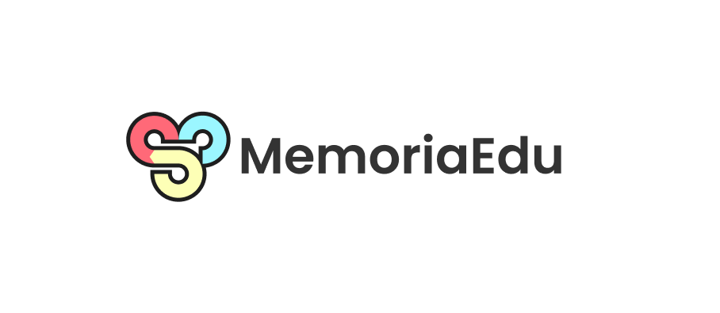

# Memoria

Memoria is an interactive online learning plateform aimed at providing individuals at all age levels a comprehensive education. With a user-friendly and engaging interface, Memoria tends to make learning enjoyable and accessible for anyone who is looking to learn and grow. 

Memoria covers a wide range of subjects, some including but not limited to:
1. Math;
2. Science;
3. Social Studies;
4. Psychology, Anthropology, Sociology;
5. Language Arts;
6. and more!

## Key Features
There are many key features to memoria of which include but are not limited to:
1. **Engaging Lessons**: Each lesson within memoria is designed to capture attention to detail and provide a broader understanding of the context behind why things work the way they do.
   
2. **Adaptive Learning & Framework**: Memoria is designed to keep you continously learning with engaging and adapting learning modules to fit your need. 
   
3. **Gamefied Progression System**: Memoria utilizes a game-like system where invidiuals are given the chance to hone their skills and progress towards a better rank. The ranking system is not determined at this stage, but as of now the ranking system is similar to that of many progressive combatesque games.
   
4. **Community & Support**: When it comes to learning, having a community that is there to support each other is important. Memoria intends to build a community for every subject or field, regardless of your level of education, you are welcome wherever.
   
5. **Safe & Secure Environemnt**: Learning can be hard and difficult and the last thing anyone wants to worry about is not having their own safety net when something becomes tough. We understand that, we understand you and intend to make it possible for everyone to learn at their own speeds without having to rely on a time-based system of modules.

*TL;DR There is a lot to take into account!*

<p align="center">
    
</p>

# Getting Started

To get started working with memoria and the contents situated within this repo, clone the repo by simply following these steps:
1. Open Git Bash;
2. Chante the current working directory to the location where you want the cloned directory;
3. Type `git clone`, and then paste the URL as such:
```tex
$ git clone https://github.com/Hi-kue/memoria
```

This should be able to give you everything you need from within the file. In order to build for npm and the rest of the svelte components follow this:
```tex
$ cd memoria
$ npm install
$ npm run dev
```

From there you will be able to see the website in a localhost with it being something like : `http://localhost:0000/`